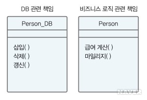

# S.O.L.I.D 정리
> **클래스를 설계할 때에 참고해야 하는 원칙! **

>> ## 1. SRP(Single Responsibility Principle)
>> ##### 클래스를 변경해야 하는 이유는 단 하나이어야 한다. 다시 말해 클래스에는 오직 한가지 기능만 있어야 한다. 혹시라도 다른 기능을 바꿀 경우에는 그 기능은 다른 클래스에 있어야 한다.

>>> #### 1.1 코드가 변경 되어도 다른 클래스에 영향을 미치지 않음
>>> #### 1.2 코드 응집성(관련된 데이터 혹은 메서드를 하나로 묶는 것)이 향상 됨
>>> #### 1.3 단위 테스트가 용이(각 클래스별 테스트를 할 수 있음) 

>>## 2. OCP(Open-Closed Principle)
>> ##### 자신의 확장에는 열려 있어야 하고, 주변의 변화에는 닫혀 있어야 한다. 다시 말하면 어떤 기능을 수정 또는 추가할 수 있어야 하고 그때 수정 또는 추가가 다른 코드에 영향을 미치면 안된다. 즉 수정과 영향없음은 필요 충분 조건이다. 클래스 확장은 쉽게, 변경은 안하도록 설계하는 것

>>> #### 2.1 클래스간 통신을 위한 인터페이스는 수정하지 않는다.
>>> #### 2.2 표준화된 인터페이스의 경우 변경비용이 크므로 충분히 테스트 후 사용 

>>## 3. LSP(Liskov substitution principle)
>> ##### 상위 클래스는 상속된 클래스로 대체 될 수 있다. 즉 상위 클래스의 기능이 하위 클래스에서도 오류 없이 동작이 되어야 한다. 즉 다형성이 적용 되어야 한다.

>>## 4. ISP(Interface Segregation Principle)
>> ##### 하나의 인터페이스 보다는 여러개의 인터페이스가 낫다. 즉 클라이언트는 자신이 사용하지 않는 메서드를 사용하면 안된다. 즉 어떤 클래스는 그 클래스에 꼭 필요한 메서드만 인터페이스로부터 제공 받아야 한다. 어차피 인터페이스는 다중으로 제공된다.

>>## 5. DIP(Dipendency Inversion Principle)
>> ##### 변하기 쉬운 클래스를 의존하지 마라, 즉 변하기 쉬운 클래스를 상속받는 대신 Interface 또는 abstract class를 이용하라

###### 읽으면 좋을만한 사이트 : [깃 배쉬 push 안될때](https://stackoverflow.com/questions/39399804/updates-were-rejected-because-the-tip-of-your-current-branch-is-behind)

###### [네이버 사전 클래스 설계 원칙](http://terms.naver.com/entry.nhn?docId=3533000&cid=58528&categoryId=58528)

